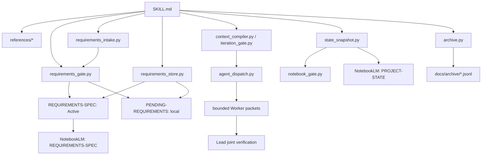

# notebooklm-iteration-loop · 项目现状

> 此为 tracked 稳定正文；NotebookLM 使用 `state_snapshot.py` 生成的同名运行快照。
> HEAD、需求 hash、diff、Pending 索引及决策包只追加于快照尾部。

## 当前迭代目标

- 实施 `REQ-011 v1.0`：请求绑定审批入口闸，堵空 Pending 误放行。

## 已验证代码事实

- Context Compiler、Iteration Budget、Iteration Gate、JSONL archive 均有 unittest。
- Active/Pending 已拆为两文件；需求脚本按显式 ID 有界读写。
- `requirements_intake.py` 绑定当前请求、需求文件、Pending 文件及批准前草稿 hash。
- `agent_dispatch.py` 已实现 baseline/packet/result hash、DAG 波次、写集/资源/隔离闸与回收计量。
- 难度确定性映射 tier/effort；Ridge profile 仅从带 revision 的宿主能力快照解析。
- 自动后端仅在任务接受前失败方降级；一经接受不得跨后端重派同 packet。
- `record-kiro-spec` 仅把获批需求、as-built 实现及成功验证写入受管 Kiro 三件套。
- 格式采用“目标仓本地惯例优先、官方三件套保底”；本地 `spec.json` 只安全补缺，不覆盖。

## 相关模块与 symbol

- `requirements_store.select_records/apply_operation`
- `requirements_intake.build_manifest/inspect_manifest`
- `state_snapshot.build_snapshot/validate_snapshot`
- `notebook_gate.evaluate/validate_notebook_output`
- `agent_dispatch.build_plan/validate_result/validate_batch`

## 最近完成与当前 diff

- 最近完成:`REQ-008` 确定性热/冷循环。
- 当前完成:`REQ-009 v1.3` 难度路由、typed profile、后端降级序与防重复重派。
- 当前完成:`REQ-010 v1.1` 本地格式探测、pi-web 风格章节与可选 `spec.json`。
- 当前完成:`REQ-011 v1.0` 请求 intake、Pending 停机与批准链硬闸。

## 验证状态

- 当前阶段:`REQ-011 v1.0` 实现完成；79 项全量测试、真实任务 intake、Skill validator、
  strict preflight 与 diff checker 通过。

## 当前失败信号与风险

- 失败信号:_无当前产品失败_。
- 风险:多 Agent 可能降墙钟却增总 token；未经同任务 A/B 不宣称节省。

## 架构边界

- 目标:以 CodeGraph 代码事实、NotebookLM 规划、需求审批与确定性验证驱动项目迭代。
- 两源:获批 `REQUIREMENTS-SPEC` + 本文；历史不上传。
- 决策:无有效 `.codegraph` 索引时不自动初始化；质量原始日志不进入状态源；历史改为有界 JSONL。
- 编排:默认过调度闸；主 Agent 保留审批/联合验证/提交权；Worker 不调 NLM；共享工作区写任务串行。
- 模型:主 Agent 标难度；profile/effort 由宿主能力快照解析并绑定 revision；Worker 不自提级。
- 后端:auto 严格 Ridge→tmux→native sub-agent→serial；任务接受后禁降级重派。
- Kiro:`执行Kiro补记` 方触发；三件套仅为非权威事后副本，不进入主循环事实链。
- 审批:每任务先过 request-bound intake；新/改/Fix/歧义均 Pending 停机，批准须绑定旧草稿。
- 核心落点:`SKILL.md` 负责最短路径；`references/` 承载冷路径；`scripts/requirements_gate.py`、
  `scripts/requirements_store.py`、`scripts/preflight.py`、`scripts/archive.py` 为确定性工具。

## 需求—代码—测试追踪

| REQ | 状态 | 证据 |
| --- | --- | --- |
| REQ-001..004 | implemented | references、两只原有脚本、7 unittest |
| REQ-005 | implemented | 增量流程、archive.py、模板/历史迁移测试 |
| REQ-006 | implemented | context_compiler.py、iteration_budget.py、iteration_gate.py、失败知识/Reviewer 模板与测试 |
| REQ-007 | implemented | requirements_store.py、显式 requirement context、审批证据与原子写入测试 |
| REQ-008 | implemented | Pending 拆分、state_snapshot.py、notebook_gate.py、热/冷协议与 49 项全量测试 |
| REQ-009 | implemented v1.3 | 模型路由、能力 revision、Ridge→tmux→native→serial 降级与防重复重派 |
| REQ-010 | implemented v1.1 | 项目惯例优先、受管三件套与可选 `spec.json` |
| REQ-011 | implemented v1.0 | request-bound intake、Pending 停机、批准链与任务入口闸 |

## Known failed approaches

- `_暂无已验证失败路径_`；后续仅写入有命令、退出码或回归证据的失败尝试。

## 下一项已批准工作

- 以 `token-usage --all` 对同任务单 Agent 与有界编排路径作 A/B；总 token 与墙钟分别度量。
