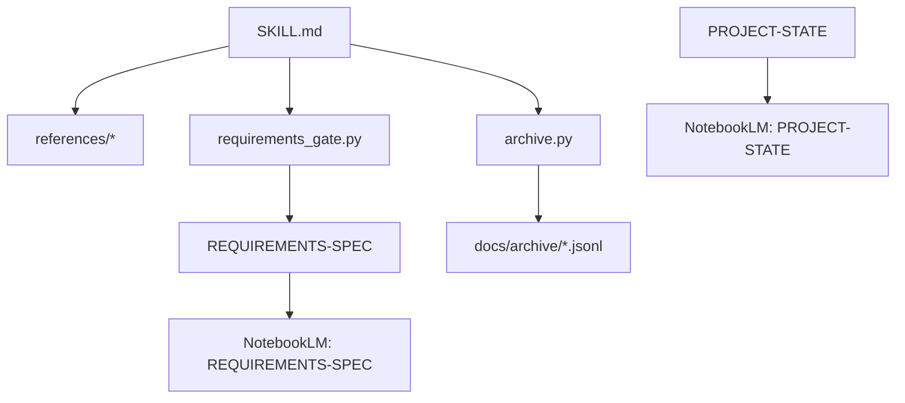

# notebooklm-iteration-loop · 项目现状

> NotebookLM 常驻 `PROJECT-STATE`。稳定基线置前且不重排；本轮 delta 仅在尾部更新。

## 稳定架构基线

- 目标:以 CodeGraph 代码事实、NotebookLM 规划、需求审批与确定性验证驱动项目迭代。
- 两源:获批 `REQUIREMENTS-SPEC` + 本文；历史不上传。
- 决策:无有效 `.codegraph` 索引时不自动初始化；质量原始日志不进入状态源；历史改为有界 JSONL。
- 核心落点:`SKILL.md` 负责最短路径；`references/` 承载冷路径；`scripts/requirements_gate.py`、
  `scripts/preflight.py`、`scripts/archive.py` 为确定性工具。

## 需求—代码—测试追踪

| REQ | 状态 | 证据 |
| --- | --- | --- |
| REQ-001..004 | implemented | references、两只原有脚本、7 unittest |
| REQ-005 | implemented | 增量流程、archive.py、模板/历史迁移测试 |
| REQ-006 | implemented | context_compiler.py、iteration_budget.py、iteration_gate.py、失败知识/Reviewer 模板与测试 |

## Known failed approaches

- `_暂无已验证失败路径_`；后续仅写入有命令、退出码或回归证据的失败尝试。

## 本轮 delta · 2026-07-29

- 变更:批准并实施 REQ-005；主 Skill 分层，删除无条件全图/NotebookLM 往返，新增 JSONL 历史工具。
- 追加:按用户方案实施 REQ-006；Context Compiler 限定读取面，预算硬闸，失败知识与 Reviewer 只读审查。
- 再收紧:显式入口、允许写集、禁止全图与背景复述；硬闸拒绝越界动作。
- 直接影响:文档/脚本/测试；本仓 CodeGraph `status` 显示未初始化，故不作索引结论。
- planning_delta:true（Agent 控制层、入口/写集硬约束改变）。
- 基线重建:false（无代码图谱可重建）。
- 验证:`python -m unittest discover -s tests -v`（24 通过）；context compiler/预算/iteration gate CLI、requirements gate、archive CLI、skill validator、`py_compile` 均退出 0。
- 质量:coverage/E2E/Sonar 仍不适用或未配置；`preflight --strict` 如实报告 `codegraph_index_missing`（索引未初始化），未自动创建索引。
