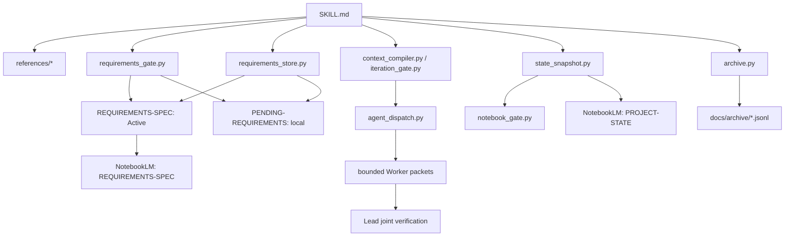

# notebooklm-iteration-loop · 项目现状

> 此为 tracked 稳定正文；NotebookLM 使用 `state_snapshot.py` 生成的同名运行快照。
> HEAD、需求 hash、diff、Pending 索引及决策包只追加于快照尾部。

## 当前迭代目标

- 实施 `REQ-009`：默认有界主控—Worker 编排；Ridge/native/tmux/serial 后端可替换。

## 已验证代码事实

- Context Compiler、Iteration Budget、Iteration Gate、JSONL archive 均有 unittest。
- Active/Pending 已拆为两文件；需求脚本按显式 ID 有界读写。
- `agent_dispatch.py` 已实现 baseline/packet/result hash、DAG 波次、写集/资源/隔离闸与回收计量。

## 相关模块与 symbol

- `requirements_store.select_records/apply_operation`
- `state_snapshot.build_snapshot/validate_snapshot`
- `notebook_gate.evaluate/validate_notebook_output`
- `agent_dispatch.build_plan/validate_result/validate_batch`

## 最近完成与当前 diff

- 最近完成:`REQ-008` 确定性热/冷循环。
- 当前完成:`REQ-009` 多 Agent 制包、后端协议、并行安全与结果回收。

## 验证状态

- 当前阶段:实现完成；67 项全量测试、其中 `agent_dispatch` 18 项定向测试，以及两路真实有界 Worker 前向验证均通过。

## 当前失败信号与风险

- 失败信号:_无当前产品失败_。
- 风险:多 Agent 可能降墙钟却增总 token；未经同任务 A/B 不宣称节省。

## 架构边界

- 目标:以 CodeGraph 代码事实、NotebookLM 规划、需求审批与确定性验证驱动项目迭代。
- 两源:获批 `REQUIREMENTS-SPEC` + 本文；历史不上传。
- 决策:无有效 `.codegraph` 索引时不自动初始化；质量原始日志不进入状态源；历史改为有界 JSONL。
- 编排:默认过调度闸；主 Agent 保留审批/联合验证/提交权；Worker 不调 NLM；共享工作区写任务串行。
- 核心落点:`SKILL.md` 负责最短路径；`references/` 承载冷路径；`scripts/requirements_gate.py`、
  `scripts/requirements_store.py`、`scripts/preflight.py`、`scripts/archive.py` 为确定性工具。

## 需求—代码—测试追踪

| REQ | 状态 | 证据 |
| --- | --- | --- |
| REQ-001..004 | implemented | references、两只原有脚本、7 unittest |
| REQ-005 | implemented | 增量流程、archive.py、模板/历史迁移测试 |
| REQ-006 | implemented | context_compiler.py、iteration_budget.py、iteration_gate.py、失败知识/Reviewer 模板与测试 |
| REQ-007 | implemented | requirements_store.py、显式 requirement context、审批证据与原子写入测试 |
| REQ-008 | implemented | Pending 拆分、state_snapshot.py、notebook_gate.py、热/冷协议与 49 项全量测试 |
| REQ-009 | implemented | agent_dispatch.py、MULTI-AGENT-PROTOCOL.md、dispatch/result 模板、18 项定向测试与两路前向验证 |

## Known failed approaches

- `_暂无已验证失败路径_`；后续仅写入有命令、退出码或回归证据的失败尝试。

## 下一项已批准工作

- 以 `token-usage --all` 对同任务单 Agent 与有界编排路径作 A/B；总 token 与墙钟分别度量。
