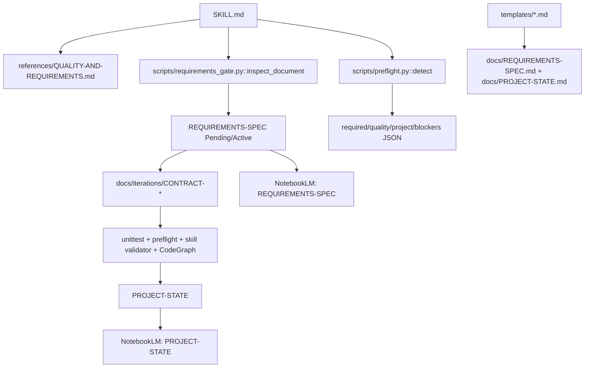
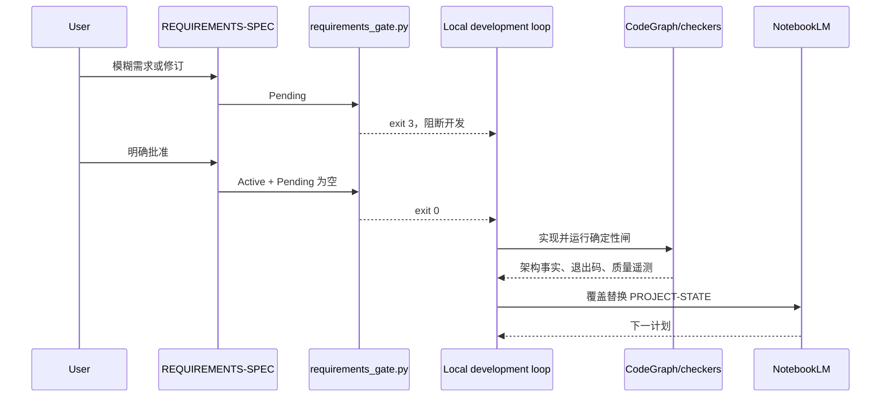

# notebooklm-iteration-loop · 项目现状

> NotebookLM 两份常驻来源之一；另一份是用户批准后才替换的 `REQUIREMENTS-SPEC`。

## 项目与稳定主线

本仓提供 codegraph + NotebookLM 驱动的迭代开发 skill、项目脚手架与配套 skills。
codegraph 给代码事实，NotebookLM 给方向，用户批准产品需求，确定性 checker 裁决实现。

锁定决策：

- 常驻来源恰为两份：批准需求与当前项目状态。
- Pending 本地隔离；批准前不改对应业务代码、不上传。
- 质量工具输出先降维，再与 codegraph 影响关联；原始长日志不上传。
- 预检只读；安装沿仓库依赖→项目级恢复→授权新增/全局安装阶梯。

## 当前架构(codegraph 2026-07-27)

- `scripts/preflight.py::detect` 读取项目标记、lockfile 与 PATH，返回 required/quality/project/blockers；
  `main` 在 `--strict` 且有 blocker 时返回 2。
- `scripts/requirements_gate.py::inspect_document` 检查三段固定结构与 Pending ID；
  `main assert-executable` 在结构错误或 Pending 存在时返回非零。
- `tests/test_preflight.py::PreflightTests` 覆盖 Node 质量栈探测、只读性与必需 blocker。
- `tests/test_requirements_gate.py::RequirementsGateTests` 覆盖空 Pending、结构化 Pending、
  非结构化 Pending。
- CodeGraph 状态：5 个 Python 文件、52 nodes、71 edges；Markdown 不受 AST 索引支持。

### 架构图

### 关键流程图

## 本轮实现

- 将《AI 时代代码质量与验证重塑》提炼为需求审批、两份真相源、质量遥测及依赖预检四项能力。
- 新增需求/质量详规、两只标准库脚本、5 个单元测试与需求模板。
- 加厚 PROJECT-STATE、WORKFLOW、CONTRACT、LOG、iterations 模板。
- 更新中英文 README 与主 skill；主 `SKILL.md` 375 行，详规渐进披露。

## 确定性验证

| 闸 | 退出码 | 结果 | 证据 |
| --- | ---: | --- | --- |
| `python -m unittest discover -s tests -v` | 0 | 5 tests passed | 本轮终端输出 |
| `requirements_gate.py ... templates/REQUIREMENTS-SPEC.md` | 0 | executable | JSON: pending_ids=[] |
| `preflight.py --project-root . --strict` | 0 | blockers=[] | JSON 输出 |
| `quick_validate.py .` | 0 | Skill is valid | 本轮终端输出 |
| `codegraph index` | 0 | 5 files, 52 nodes, 71 edges | CodeGraph status |

## 质量遥测

| 能力 | 状态 | 基线/门槛 |
| --- | --- | --- |
| Python unittest | available | 全绿、exit 0 |
| requirements gate | available | Pending 为空、exit 0 |
| skill validator | available | valid、exit 0 |
| coverage | missing | 下一轮候选：为脚本建立 branch coverage 基线 |
| E2E | not-applicable | 此仓无运行时 UI/服务；CLI 集成测试可补 |
| Sonar | missing | 当前无配置；先以标准库测试与 validator 作闸 |

## 需求—代码—测试追踪

| Active REQ | 状态 | 代码/文档 | 测试/证据 |
| --- | --- | --- | --- |
| REQ-001 | implemented | reference + PROJECT-STATE 模板 | quick_validate |
| REQ-002 | implemented | requirements_gate.py | 3 gate tests |
| REQ-003 | implemented | skill/README/templates + 两份真相源 | NotebookLM source_count=2 |
| REQ-004 | implemented | preflight.py | 2 preflight tests + strict run |

## 差距与请 NotebookLM 定夺

NotebookLM 已建议下一轮聚焦 CLI 黑盒测试、遥测解析、preflight 扩展、changed-code policy 与需求关系校验。
对抗评审后落为 `CONTRACT-iteration-2.md`：JSON manifest、显式 policy、preview-only 审批、无任意 shell、
无固定 80% 阈值。

当前外部状态：目标笔记本已清理为 `REQUIREMENTS-SPEC`、`PROJECT-STATE` 两份常驻来源。
本地旧同名 skill 已移出发现目录备份，新版仅安装于 `.codex/skills/notebooklm-iteration-loop`。
