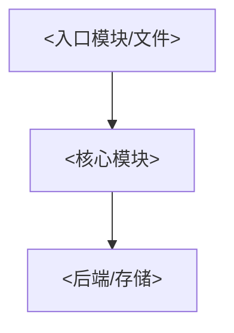
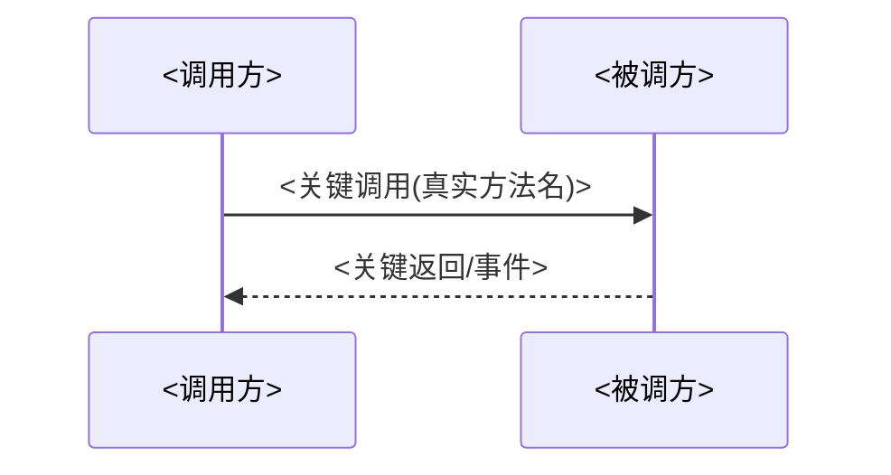

# <项目名> · 项目现状(PROJECT-STATE)

> NotebookLM 两份常驻来源之一；另一份是仅在用户批准需求后替换的 `REQUIREMENTS-SPEC`。
> 本文每轮**覆盖式重写**,不要堆积历史；历史见 git 与 `docs/iterations/`。

## 项目是什么

<一段话:目标、边界、非目标>

## 稳定段:不可动摇的设计主线 / 已锁定决策

- <决策 1 + 理由,少改>
- <决策 2 + 理由,少改>

## 当前架构(由 codegraph 勾勒,每轮刷新)

- 模块与落点:`<codegraph_context / codegraph_files 的结果摘要>`
- 关键接口签名:`<codegraph_explore 的结果摘要>`
- 关键调用路径:`<codegraph_trace from→to 的结果摘要>`
- 目录现状:`<codegraph_files 的结果摘要>`

### 架构图(mermaid,节点用真实符号/文件名,每轮随现状同步)



### 关键流程图(主链路,一图一流程)



## 本轮做了什么

- <变更 1,含文件/模块落点>
- <变更 2>

## 确定性验证证据

```text
<命令 + 输出摘要 / 退出码>
```

## 质量遥测

### 验证能力

| 能力 | 命令 | 状态 | 基线/门槛 |
| --- | --- | --- | --- |
| 编译/typecheck | `<command>` | available/missing | exit 0 |
| unit/coverage | `<command>` | available/missing | `<Active REQ / WORKFLOW 定义>` |
| E2E | `<command>` | available/not-applicable/missing | `<场景门槛>` |
| Sonar/lint | `<command>` | available/missing | `<quality gate / new issues=0>` |

### 本轮结果

| 闸 | 退出码 | 结果 | 相对基线 | 证据 |
| --- | ---: | --- | --- | --- |
| `<gate>` | `<code>` | pass/fail | `<delta>` | `<本地 artifact / CI URL>` |

### 待处理信号

| ID | 类别 | 严重度 | 文件/符号 | codegraph 影响 | 证据 | 处置 |
| --- | --- | --- | --- | --- | --- | --- |
| `<Q-001>` | bug/debt/refactor/requirement-candidate | `<level>` | `<path/symbol>` | `<impact/不可判>` | `<pointer>` | `<contract/Pending/non-goal>` |

## 需求—代码—测试追踪

| Active REQ | 状态 | 代码证据 | 测试/质量证据 |
| --- | --- | --- | --- |
| `REQ-<...>` | implemented/gap | `<path/symbol>` | `<test/gate>` |

## 能力对照(距最终目标差什么)

- <差距 1>
- <差距 2>

## 开放问题 / 请 NotebookLM 定夺

1. <问题 1>
2. <问题 2>
