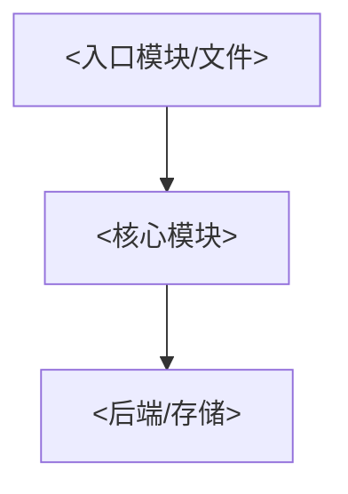
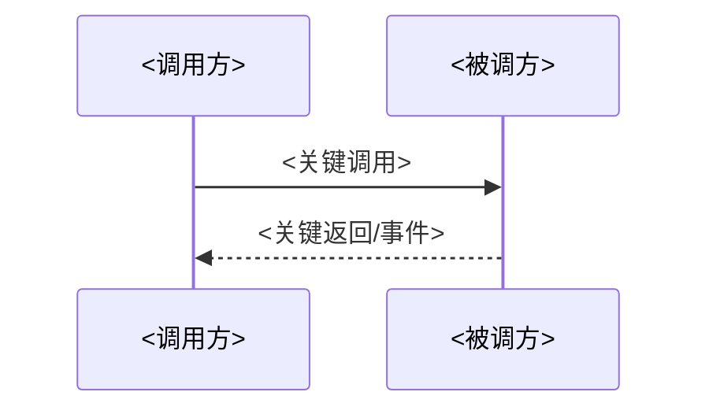

# <项目名> · 项目现状(PROJECT-STATE)

> NotebookLM 两份常驻来源之一；另一份是获批后替换的 `REQUIREMENTS-SPEC`。
> 稳定基线置前且尽量字节不变；本轮 delta 置尾。历史只存 `docs/archive/` JSONL。

## 项目与稳定架构基线（仅边界变化时更新）

- 目标/非目标:`<一句话>`
- 锁定决策:`<少改的决策+理由>`
- 基线依据:`<commit / CodeGraph version+status>`
- 模块与落点:`<codegraph explore 的事实摘要>`
- 关键接口/直接路径:`<已验证 symbol>`

### 架构图（边界未变则原样保留）

### 关键流程图（边界未变则原样保留）

## 需求—代码—测试追踪（仅需求变化时更新）

| Active REQ | 状态 | 代码证据 | 测试/质量证据 |
| --- | --- | --- | --- |
| `REQ-<...>` | implemented/gap | `<path/symbol>` | `<test/gate>` |

## Known failed approaches（仅记已验证失败）

- `<approach>` — 原因:`<可复核证据>`；替代:`<下一次允许路径>`
- `_暂无已验证失败路径_`

## 本轮 delta（每轮仅改此段）

- 变更:`<paths/symbols>`
- 直接影响:`<impact/affected 或不可判>`
- planning_delta:`true/false + 理由`
- 基线重建:`true/false + 触发条件`
- 验证:`<命令 + exit + 有界摘要 + evidence>`
- 质量:`<计数/相对基线/待处理 ID>`
- 下一步:`<仅 planning_delta=true 时填写>`
